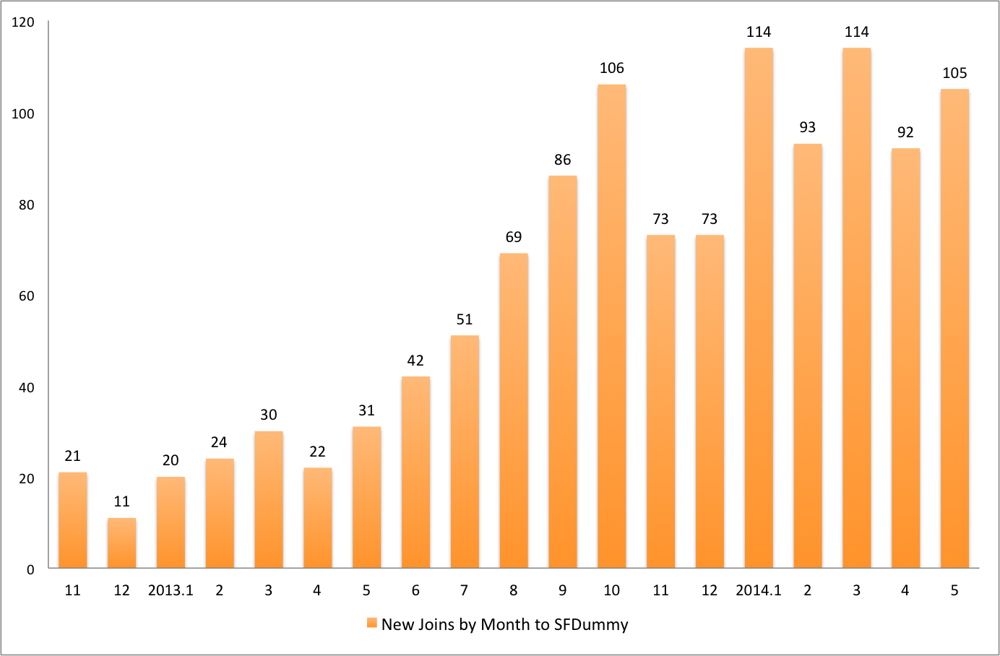

my_meetup_groups
================
As I'm becoming a fan of meetup groups, the data of different groups from this website intrigues me: how popular is this group in the area? When does it become popular? What interest do people have in common across some specific groups?
Inspired by Facebook.com "page like" statistics, I have developed this small tool, to support visualization of insight that can be gained through meetup.com API from the groups that I'm a member of.
As an example, the image below shows the numbers of newly members to a certain group by month, from the group establishment time to the most recent month. And those numbers are gained from running this tool.
This is a sample data plot
